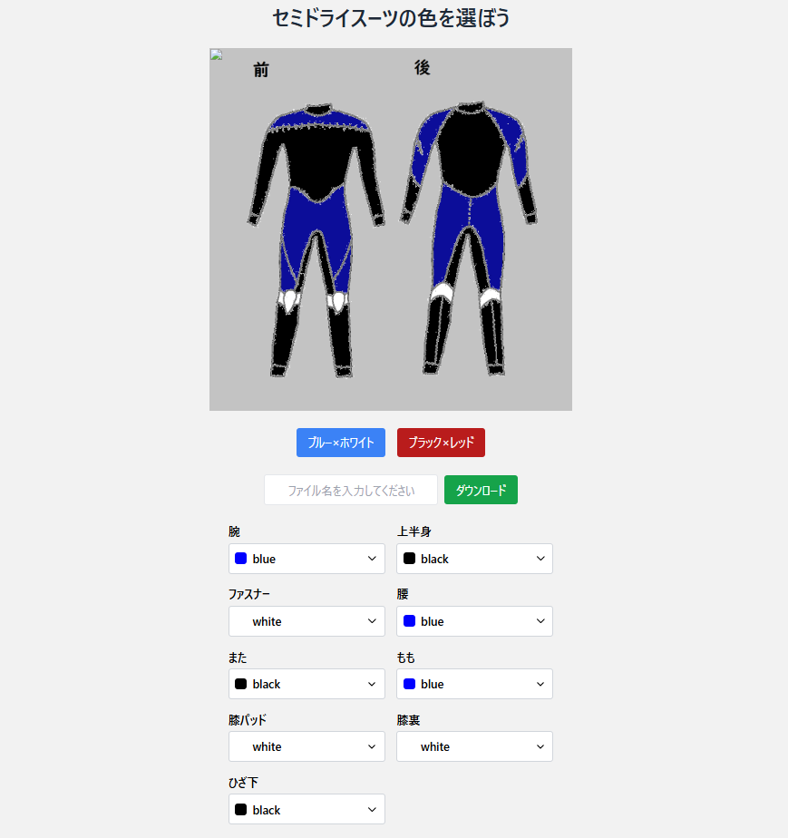

# セミドライスーツ カラーシミュレーター



このプロジェクトは、ダイビング用セミドライスーツのカラーを自由にシミュレーションできるWebアプリケーションです。  
パーツごとにカラーを選択し、リアルタイムでデザインを確認することができます。  
完成したデザインは画像としてダウンロードすることも可能です。

## 構成

- **HTML / TailwindCSS / JavaScript**
- **html2canvas**ライブラリを利用して画像ダウンロード機能を実装
- 静的サイトとしてホスティング可能（例：Vercel）

## 使い方

1. 各パーツのカラーを選択してください。
2. プリセットボタンでおすすめ配色を適用することもできます。
3. ファイル名を入力して「ダウンロード」ボタンを押すと、デザインをPNG画像として保存できます。

## フォルダ構成

```plaintext
/
├── index.html
├── images/
│   ├── Semi-dry_bk_bggray.png
│   ├── parts1/
│   ├── parts2/
│   ├── waist/
│   ├── crotch/
│   ├── thigh/
│   ├── kneespad/
│   ├── knees/
│   ├── calf/
│   └── fastener/
└── README.md
```
## ToDo（拡張予定リスト）

- [ ] カラー選択パーツの追加・部位詳細化（例：肩、襟など）
- [ ] 素材選択機能（ジャージ素材、ドライ素材など）
- [ ] デザインパターンのプリセット追加（カラーテーマ拡充）
- [ ] サイズシミュレーション（S/M/L選択）
- [ ] 作成したデザインの共有機能（SNS連携）
- [ ] AstroまたはNext.jsなどへのフレームワーク移行検討
- [ ] データ管理を分離（カラー・パーツ情報をJSON管理）
- [ ] 多言語対応（英語版サイト作成）

## 開発環境

- ローカルサーバー必須（CORS制限回避のため）
  - 簡単なサーバー起動例（Python使用）：
    ```bash
    python3 -m http.server
    ```
- 推奨ブラウザ：
  - 最新のGoogle Chrome
  - Microsoft Edge

## デプロイについて

このプロジェクトは静的サイトホスティングで簡単に公開できます。

推奨ホスティングサービス例：
- [Vercel](https://vercel.com/)
- [Netlify](https://www.netlify.com/)
- [GitHub Pages](https://pages.github.com/)

### デプロイ手順（Vercelの場合）

1. GitHubにリポジトリを作成・push
2. Vercelにログイン（GitHub連携）
3. 「New Project」で対象リポジトリを選択
4. 設定変更不要、そのまま「Deploy」

これだけで公開完了できます！

## ライセンス

MITライセンス

